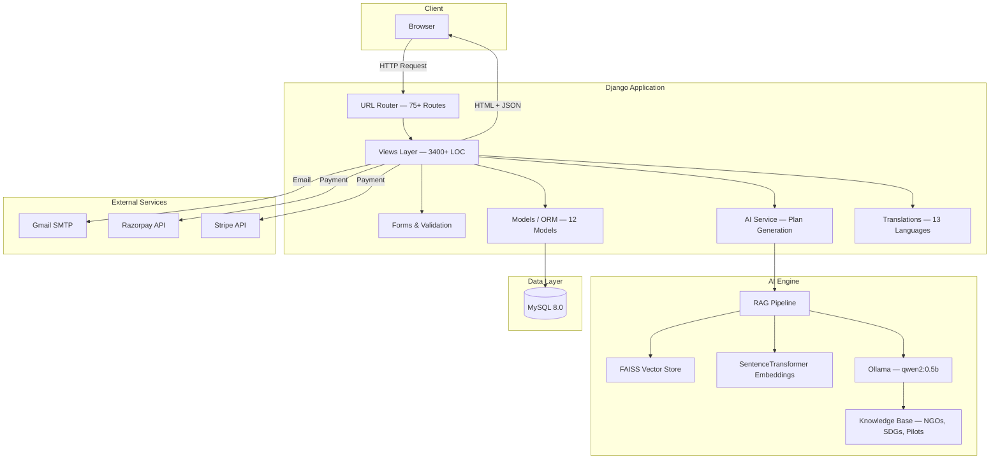
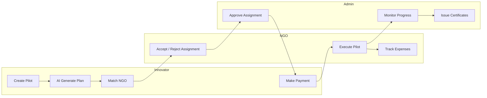
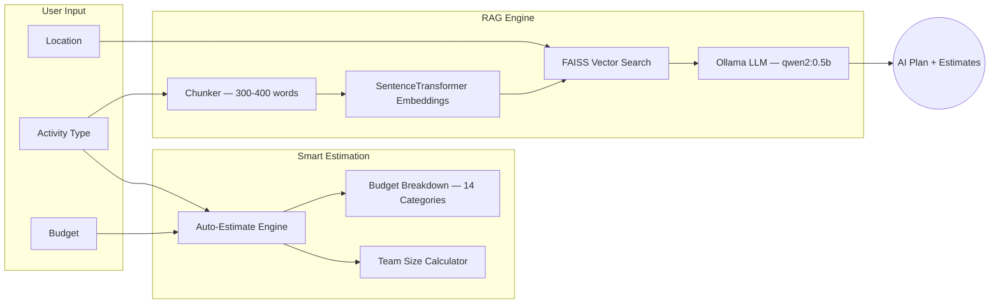
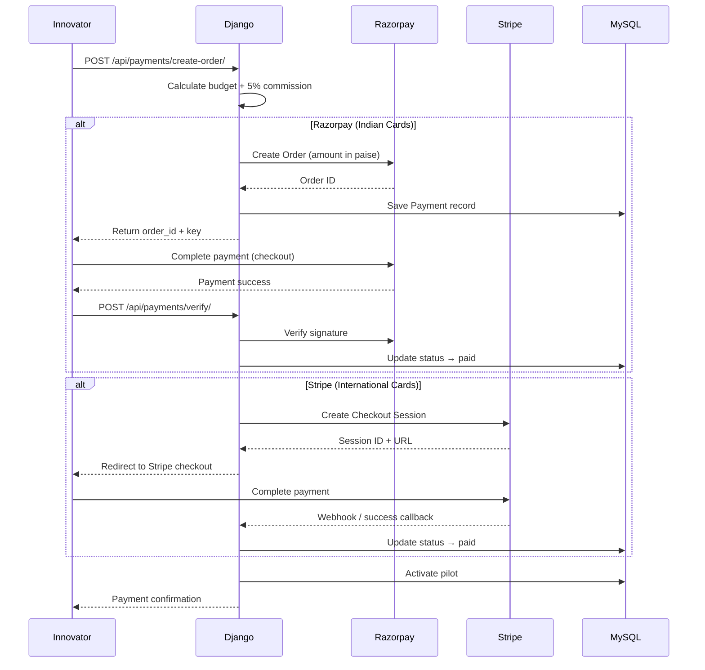
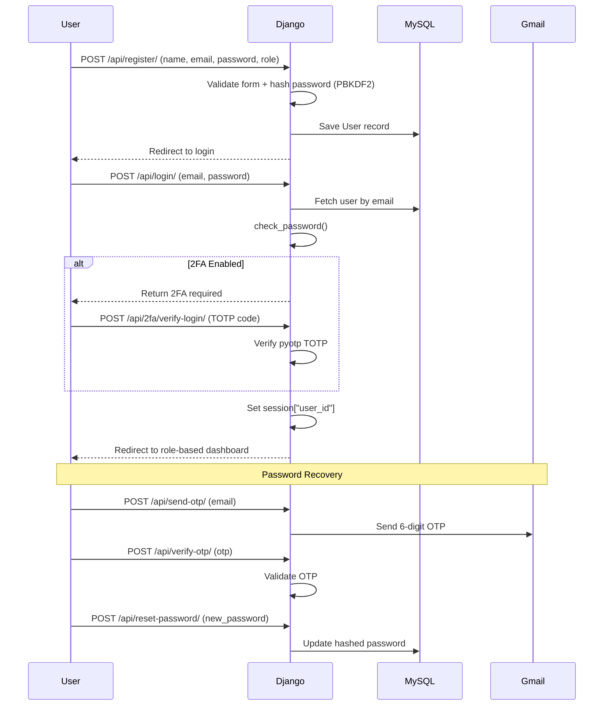
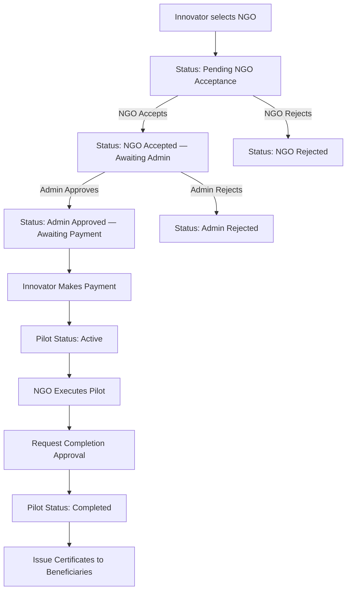

<div align="center">


<br/>

[](https://github.com/)

<br/>

<a href="https://humanloop-production-839d.up.railway.app">
  
</a>

<br/><br/>


<br/><br/>

```text
🤖 AI PLAN  →  🏢 MATCH NGO  →  💳 PAY & LAUNCH  →  📊 TRACK IMPACT
```

</div>

---

> **HumanLoop** · Social Pilot Management & AI-Powered Impact Platform  
> **Platform Status:** Operational · [Live on Railway](https://humanloop-production-839d.up.railway.app)  
> **Architecture:** Full Stack Django Monolith + MySQL + RAG Engine  

HumanLoop connects **Innovators**, **NGOs**, **Admins**, and **Beneficiaries** to launch, manage, and track social impact pilots. It features AI-powered planning via a local RAG engine (FAISS + Ollama), smart location-aware NGO matching, dual payment gateways (Razorpay + Stripe) with platform commission, real-time dashboards, TOTP-based two-factor authentication, multilingual support (13 languages), and a comprehensive document vault — all deployed production-ready on Railway.

<div align="center">

| 🤖 AI Planning | 🏢 NGO Matching | 💳 Payments | 📊 Dashboards |
|:---:|:---:|:---:|:---:|
| RAG-powered plan generation | Location-aware scoring | Razorpay + Stripe | 4 role-based dashboards |
| Auto team/beneficiary estimates | Area → City proximity | 5% platform commission | Expense tracking |
| Budget breakdown engine | Intelligent fallback | Payment verification | Task & progress management |

</div>

---

## Table of Contents

<details open>
<summary><b>Navigate</b></summary>

| # | Section | # | Section |
|---:|---|---:|---|
| 1 | [Overview](#1-overview) | 6 | [Architecture & Workflows](#6-architecture--workflows) |
| 2 | [Problem Statement](#2-problem-statement) | 7 | [Repository Structure](#7-repository-structure) |
| 3 | [Links & Credentials](#3-links--credentials) | 8 | [Authentication & Security](#8-authentication--security) |
| 4 | [Features & Deliverables](#4-features--deliverables) | 9 | [Setup (Local)](#9-setup-local) |
| 5 | [Technology Stack](#5-technology-stack) | 10 | [User Roles](#10-user-roles) |

</details>

---

## 1. Overview

**HumanLoop** is a full-stack social pilot management platform designed to streamline the entire lifecycle of social impact initiatives — from AI-assisted planning to execution, payment, and impact measurement.

| Capability | What it does |
|---|---|
| AI-Powered Pilot Planner | Auto-generates detailed pilot plans using a local RAG engine (FAISS + Ollama qwen2:0.5b) with smart budget breakdowns, team size estimates, and beneficiary projections across 14 activity categories. |
| Smart NGO Matching | Location-aware scoring system with area → city proximity detection, matching innovator projects with the most suitable local NGOs. |
| Dual Payment Gateway | Razorpay (Indian cards) + Stripe (International) with 5% platform commission, order tracking, and payment verification. |
| Role-Based Dashboards | Four dedicated dashboards — Innovator, NGO, Admin, Beneficiary — each with tailored stats, actions, and real-time notifications. |
| Expense Tracking | NGOs manage pilot expenses with category-based tracking; Innovators have read-only visibility into spending. |
| Task Management | Checklist-based pilot progress tracking with percentage completion and status transitions. |
| Document Vault | Upload, download, and manage files per pilot with size tracking. |
| Certificates | Admins issue completion certificates to beneficiaries with unique certificate numbers and PDF export. |
| Two-Factor Authentication | TOTP-based 2FA with QR code setup using pyotp. |
| Multilingual Support | 13 Indian languages (Hindi, Gujarati, Bengali, Tamil, Telugu, etc.) for Beneficiary-facing interfaces. |
| Feedback System | Beneficiaries and users provide star-rated feedback on pilots with detailed messages. |
| Audit Logging | Full audit trail of user actions with IP address tracking for compliance. |

Stack shape: **JavaScript + HTML + CSS** frontend · **Django 4.2** backend · **MySQL 8.0** database · **Ollama + FAISS** AI engine · **Razorpay + Stripe** payments · Session Auth + TOTP 2FA · Railway deployment.

---

## 2. Problem Statement

### Bridging the Gap Between Social Innovators and On-Ground NGOs

**Problem Abstract**  
Social innovators with impactful ideas often struggle to find, coordinate, and fund the right NGOs to execute their projects. The process involves fragmented communication, manual planning, opaque financials, and zero visibility into pilot progress. Meanwhile, NGOs lack a streamlined way to discover, accept, and manage assigned pilots.

HumanLoop addresses this by providing:
1. An **AI-powered planner** that generates complete pilot plans — team size, budget breakdown, beneficiary estimates — using a RAG engine trained on social impact knowledge bases (NGO data, SDG guidelines, pilot case studies).
2. A **smart NGO matching engine** that scores and ranks NGOs based on location proximity, activity expertise, and availability.
3. A **dual payment system** (Razorpay + Stripe) with transparent 5% platform commission, enabling instant funding with built-in payment verification.
4. A **multi-role dashboard ecosystem** (Innovator / NGO / Admin / Beneficiary) with real-time notifications, task tracking, and expense visibility.
5. A **certificate and feedback system** that tracks beneficiary engagement, issues completion certificates, and captures impact metrics.

**Expected Outcomes**
- `→` AI-generated pilot plans across 14 social impact activity categories
- `→` Location-aware NGO matching with proximity-scored recommendations
- `→` Seamless payment flow with Razorpay (domestic) and Stripe (international) support
- `→` Role-based dashboards with real-time stats, notifications, and audit logs
- `→` Expense tracking with category breakdowns and read-only innovator access
- `→` Beneficiary enrollment, session tracking, and badge/gamification system
- `→` TOTP-based 2FA, OTP password recovery, and comprehensive user settings
- `→` Multilingual support across 13 Indian languages
- `→` Certificate generation with PDF export and unique certificate numbering

**Evaluation Criteria Mapping**

| Criteria | Implementation in HumanLoop |
|:---|:---|
| **Understanding of Problem** | Directly targets the coordination gap between social innovators and NGOs, providing an end-to-end platform for pilot lifecycle management. |
| **Proposed Approach** | Django 4.2 + MySQL monolith with local RAG-powered AI planning (FAISS + Ollama), dual payment gateways, multi-role access control, and Railway cloud deployment. |
| **Market Fit & Relevance** | Serves a growing social impact ecosystem where CSR mandates, government schemes, and grassroots organizations need efficient pilot management tools with transparent financials. |

---

## 3. Links & Credentials

| Resource | Link / Note |
|---|---|
| Live Platform (Railway) | [humanloop-production-839d.up.railway.app](https://humanloop-production-839d.up.railway.app) |
| Local API | `http://127.0.0.1:8000` |
| Admin Panel | `http://127.0.0.1:8000/admin` |
| Email Service | Gmail SMTP (configurable via `.env`) |
| Docker | `Dockerfile` included for containerized deployment |

### Page Routes

| Page | URL Route | Description |
|---|---|---|
| Landing Page | `/` | Home / marketing page |
| About | `/about/` | Platform information |
| Demo | `/demo/` | Interactive demo walkthroughs |
| Login | `/login/` | User authentication |
| Register | `/register/` | New account creation (role selection) |
| Forgot Password | `/forgot-password/` | OTP-based password recovery |
| Innovator Dashboard | `/dashboard/` | Create pilots, manage payments, track progress |
| NGO Dashboard | `/dashboard-ngo/` | Accept/reject assignments, manage expenses |
| Admin Dashboard | `/dashboard-admin/` | User management, assignment approvals, audit logs |
| Beneficiary Dashboard | `/dashboard-beneficiary/` | Explore programs, enroll, provide feedback |
| AI Planner | `/planner/` | AI-powered pilot plan generation |
| Pilot Detail | `/pilot/` | Task management & progress tracking |
| Expenses | `/expenses/` | Expense tracking per pilot |
| Feedback | `/feedback/` | Submit & view feedback |
| Settings | `/settings/` | Profile, 2FA, notifications, privacy, language |
| Team | `/team/` | Organization team management |
| Partners | `/partners/` | Partner showcase |
| Contact | `/contact/` | Contact form |
| Privacy Policy | `/privacy-policy/` | Privacy policy page |
| Terms of Service | `/terms-of-service/` | Terms and conditions |
| Cookie Policy | `/cookie-policy/` | Cookie policy page |

---

## 4. Features & Deliverables

### Core Features

| # | Feature | Status |
|---:|---|:---:|
| 01 | Role-Based Access Control (Innovator, NGO, Admin, Beneficiary) | ✅ |
| 02 | Email/Password Signup with Role & Organization Selection | ✅ |
| 03 | OTP-based Password Recovery (Gmail SMTP) | ✅ |
| 04 | TOTP Two-Factor Authentication with QR Code Setup | ✅ |
| 05 | AI-Powered Pilot Plan Generation (RAG + Ollama) | ✅ |
| 06 | Smart Auto-Estimation (Team Size, Beneficiaries, Budget Breakdown) | ✅ |
| 07 | Location-Aware NGO Matching (Area → City Proximity Scoring) | ✅ |
| 08 | Pilot Lifecycle Management (Draft → Active → Completed) | ✅ |
| 09 | NGO Assignment Workflow (Request → Accept → Admin Approve → Pay) | ✅ |
| 10 | Dual Payment Gateway (Razorpay + Stripe) with 5% Commission | ✅ |
| 11 | Expense Tracking with Category Breakdown | ✅ |
| 12 | Task Management (Checklist-based Progress Tracking) | ✅ |
| 13 | Real-Time Notification System | ✅ |
| 14 | Beneficiary Program Enrollment & Session Tracking | ✅ |
| 15 | Feedback System (Star Ratings + Messages) | ✅ |
| 16 | Certificate Issuance with PDF Export | ✅ |
| 17 | Document Vault (Upload/Download per Pilot) | ✅ |
| 18 | Audit Log with IP Tracking | ✅ |
| 19 | User Settings (Profile, Notifications, Privacy, Language) | ✅ |
| 20 | Interactive Financial Reports & Dashboard Stats | ✅ |

### Bonus Features

| # | Feature | Status |
|---:|---|:---:|
| B1 | Multilingual Support (13 Indian Languages) | ✅ |
| B2 | AI Insights API (Contextual Intelligence) | ✅ |
| B3 | Local RAG Engine (FAISS + SentenceTransformers + Ollama) | ✅ |
| B4 | Railway Cloud Deployment (Production-Ready) | ✅ |
| B5 | Docker Containerization | ✅ |
| B6 | WhiteNoise Static File Serving | ✅ |
| B7 | Data Export (User Data Download) | ✅ |
| B8 | Gamification (Badges for Beneficiaries) | ✅ |
| B9 | Team Member Management (Org-Scoped) | ✅ |
| B10 | About, Contact, Partners, Team, Demo Pages | ✅ |
| B11 | Legal Pages (Privacy, Terms, Cookies) | ✅ |
| B12 | Health Check API Endpoint | ✅ |

---

## 5. Technology Stack

<div align="center">

</div>

<br/>

<div align="center">


</div>

<br/>

| Layer | Technology | Purpose |
|---|---|---|
| **Backend** | Django 4.2.28 (Python 3.13) | Views, session auth, business logic, API endpoints |
| **Database** | MySQL 8.0 (utf8mb4) | Persistent storage — users, pilots, payments, expenses, certificates |
| **AI Engine** | Ollama (qwen2:0.5b) + FAISS + SentenceTransformers | RAG-powered pilot plan generation and intelligent insights |
| **Frontend** | JavaScript ES6 + HTML5 + CSS3 | Dynamic UI, AJAX interactions, DOM manipulation |
| **Payments** | Razorpay + Stripe | Dual payment gateway with 5% platform commission |
| **2FA** | pyotp + qrcode | TOTP-based two-factor authentication with QR code setup |
| **Email** | Django SMTP (Gmail) | OTP delivery, notifications, transactional emails |
| **Images** | Pillow | Image processing for uploads and certificates |
| **Static Files** | WhiteNoise | Production static file serving on Railway |
| **Deployment** | Railway + Docker + Nixpacks | Cloud deployment with auto-migration and Gunicorn |
| **HTTP** | Gunicorn | Production WSGI server |
| **Environment** | python-dotenv | Environment variable management |

---

## 6. Architecture & Workflows

### 6.1 Overall System Architecture


### 6.2 Pilot Lifecycle Pipeline


### 6.3 AI Plan Generation Pipeline


### 6.4 Payment Flow (Razorpay + Stripe)


### 6.5 Authentication & Session Flow


### 6.6 NGO Assignment Workflow


---

## 7. Repository Structure

```text
HumanLoop/
├── .dockerignore                      # Docker ignore rules
├── .github/                           # GitHub configuration
├── Dockerfile                         # Docker containerization (Python 3.13-slim)
├── README.md                          # This file
│
├── AI/                                # AI & RAG Engine (standalone module)
│   └── rag_engine/
│       ├── knowledge_base/            # Static knowledge documents
│       │   ├── guidelines/            # Social impact guidelines
│       │   ├── ngos/                  # NGO profiles & data
│       │   ├── pilots/                # Pilot case studies
│       │   └── sdg/                   # UN SDG reference material
│       ├── llm/                       # LLM integration
│       │   ├── ollama_client.py       # Ollama HTTP client
│       │   └── prompt_builder.py      # Prompt engineering templates
│       ├── scripts/                   # Utility scripts
│       ├── build_index.py             # FAISS index builder
│       ├── chunker.py                 # Text chunker (300–400 words, 50 overlap)
│       ├── embedder.py                # SentenceTransformer embeddings
│       ├── kb_loader.py               # Knowledge base document loader
│       ├── main_demo.py               # Interactive RAG demo
│       ├── pilot_plan_model.py        # Pilot plan data model
│       ├── rag_pipeline.py            # End-to-end RAG pipeline
│       ├── retriever.py               # FAISS vector search retriever
│       ├── index.faiss                # Pre-built FAISS index (~4.6 MB)
│       ├── metadata.json              # Chunk metadata (~7.5 MB)
│       └── requirements.txt           # AI-specific dependencies
│
└── humanloop_backend/                 # Django project root
    ├── manage.py                      # Django CLI entry point
    ├── requirements.txt               # Python dependencies (12 packages)
    ├── runtime.txt                    # Python 3.13.2 runtime spec
    ├── Procfile                       # Railway/Heroku process definition
    ├── railway.json                   # Railway deployment config
    ├── nixpacks.toml                  # Nixpacks build config
    ├── .env.example                   # Environment variable template
    ├── .gitignore                     # Git ignore rules
    │
    ├── humanloop_backend/             # Django project config
    │   ├── settings.py                # Settings (MySQL, SMTP, Railway, Stripe, Razorpay)
    │   ├── urls.py                    # Root URL configuration
    │   ├── wsgi.py                    # WSGI entry point
    │   └── asgi.py                    # ASGI entry point
    │
    ├── core/                          # Main Django application
    │   ├── models.py                  # 12 models (User, Pilot, Payment, Certificate, etc.)
    │   ├── views.py                   # 75+ endpoints — 3,400+ LOC
    │   ├── forms.py                   # 8 Django forms with validation
    │   ├── urls.py                    # 75+ URL routes (pages + APIs)
    │   ├── admin.py                   # Admin panel registration (12 models)
    │   ├── ai_service.py              # AI bridge — plan generation, NGO matching, insights
    │   ├── translations.py            # 13-language translation mappings (~140 KB)
    │   └── management/commands/
    │       ├── createsuperadmin.py     # Auto-create admin user for deployment
    │       ├── seed_team_members.py    # Seed demo team members
    │       └── seedusers.py           # Seed demo users
    │
    ├── templates/                     # 24 HTML templates
    │   ├── index.html                 # Landing page
    │   ├── login.html                 # Login page
    │   ├── register.html              # Registration (role selection)
    │   ├── dashboard.html             # Innovator dashboard
    │   ├── dashboard-ngo.html         # NGO dashboard
    │   ├── dashboard-admin.html       # Admin dashboard
    │   ├── dashboard-beneficiary.html # Beneficiary dashboard
    │   ├── planner.html               # AI pilot planner
    │   ├── pilot.html                 # Pilot detail & tasks
    │   ├── expenses.html              # Expense tracker
    │   ├── feedback.html              # Feedback system
    │   ├── settings.html              # User settings & 2FA
    │   ├── explore-programs.html      # Beneficiary program browser
    │   ├── team.html                  # Team management
    │   ├── demo.html                  # Interactive demo
    │   ├── about.html                 # About page
    │   ├── contact.html               # Contact page
    │   ├── partners.html              # Partners showcase
    │   ├── forgot-password.html       # Password recovery
    │   ├── verify-otp.html            # OTP verification
    │   ├── privacy-policy.html        # Privacy policy
    │   ├── terms-of-service.html      # Terms of service
    │   ├── cookie-policy.html         # Cookie policy
    │   └── 403.html                   # Forbidden error page
    │
    ├── static/                        # Static assets
    │   ├── style.css                  # Global stylesheet (~29 KB)
    │   ├── script.js                  # Global JavaScript (~54 KB)
    │   ├── index.css                  # Landing page styles
    │   ├── login.css                  # Auth page styles
    │   ├── dashboard.css              # Dashboard styles
    │   ├── dashboard-admin.css        # Admin dashboard styles
    │   ├── planner.css                # AI planner styles
    │   ├── pilot.css                  # Pilot detail styles
    │   ├── expenses.css               # Expense tracker styles
    │   ├── feedback.css               # Feedback page styles
    │   ├── settings.css               # Settings page styles
    │   ├── register.css               # Registration styles
    │   ├── about.css                  # About page styles
    │   ├── contact.css                # Contact page styles
    │   ├── partners.css               # Partners page styles
    │   ├── team.css                   # Team page styles
    │   ├── 403.css                    # Error page styles
    │   ├── favicon.svg                # Site favicon
    │   └── demos/                     # Demo recordings (.webp)
    │
    ├── fix_admin.py                   # Admin setup helper
    ├── fix_quotes.py                  # Template quote fixer
    ├── fix_static_quotes.py           # Static file quote fixer
    ├── fix_translations.py            # Translation fixer
    ├── gen_hash.py                    # Password hash generator
    └── setup_templates.py             # Template setup utility
```

---

## 8. Authentication & Security

Authentication is handled via **Django's Session framework** with custom session-based access control. Passwords are hashed using Django's `make_password` / `check_password` utilities (PBKDF2 by default). Two-factor authentication adds an additional TOTP verification layer.

| Feature | Implementation |
|---|---|
| **Signup** | Name, email, password, role selection (Innovator/NGO/Beneficiary), organization (optional) |
| **Login** | Email + password → session-based auth with role-based dashboard redirect |
| **Session** | `request.session['user_id']` — 24-hour expiry, DB-backed sessions |
| **Logout** | Session flush with cache-busting headers |
| **Password Recovery** | 6-digit OTP via Gmail SMTP → new password reset |
| **Two-Factor Auth** | TOTP (pyotp) with QR code setup, verified on each login |
| **CSRF Protection** | Django CSRF middleware with trusted origins for Railway |
| **Audit Logging** | Full action trail with IP address tracking |
| **Account Deletion** | Self-service account deletion via settings |
| **HTTPS (Production)** | SSL via Railway proxy with secure cookie configuration |

### API Authentication
All API endpoints use a custom `@login_required_json` decorator that returns `401 Unauthorized` for unauthenticated requests:
```python
@login_required_json
def api_endpoint(request):
    # Only accessible with valid session
    ...
```

---

## 9. Setup (Local)

### Prerequisites

- Python 3.10+
- MySQL 8.0+
- Ollama (optional, for AI features)

### 1. Clone the Repository

```bash
git clone https://github.com/your-username/humanloop.git
cd humanloop
```

### 2. Backend Setup

```bash
cd humanloop_backend
python -m venv venv

# Windows
venv\Scripts\activate

# macOS/Linux
source venv/bin/activate

pip install -r requirements.txt
```

### 3. Configure Environment Variables

```bash
# Copy the example env file
cp .env.example .env

# Edit .env with your actual values:
# - Database credentials (DB_NAME, DB_USER, DB_PASSWORD)
# - Gmail SMTP (EMAIL_HOST_USER, EMAIL_HOST_PASSWORD)
# - Razorpay keys (RAZORPAY_KEY_ID, RAZORPAY_KEY_SECRET)
# - Stripe keys (STRIPE_PUBLISHABLE_KEY, STRIPE_SECRET_KEY)
# - AI model (AI_MODEL=qwen2:0.5b)
```

### 4. Setup MySQL Database

```sql
CREATE DATABASE humanloop CHARACTER SET utf8mb4 COLLATE utf8mb4_unicode_ci;
```

### 5. Run Migrations & Create Admin

```bash
python manage.py migrate
python manage.py createsuperuser
```

### 6. Start the Development Server

```bash
python manage.py runserver
```

Visit: `http://127.0.0.1:8000`

### 7. AI Setup (Optional)

```bash
# Install Ollama (https://ollama.ai)
ollama pull qwen2:0.5b

# Build the RAG vector index
cd ../AI/rag_engine
pip install -r requirements.txt
python build_index.py
```

> Without Ollama, the platform uses intelligent fallback templates for plan generation.

### 8. Docker Setup (Alternative)

```bash
# From project root
docker build -t humanloop .
docker run -p 8000:8000 --env-file humanloop_backend/.env humanloop
```

---

## 10. User Roles

<div align="center">

| Role | Dashboard | Key Capabilities |
|:---:|:---:|---|
| 🚀 **Innovator** | `/dashboard/` | Create pilots, generate AI plans, select NGOs, make payments, view expenses, track progress |
| 🏢 **NGO** | `/dashboard-ngo/` | Accept/reject assignments, execute pilots, manage expenses, add team members |
| 🛡️ **Admin** | `/dashboard-admin/` | Approve assignments, manage users, view audit logs, issue certificates |
| 🌱 **Beneficiary** | `/dashboard-beneficiary/` | Explore programs, enroll, attend sessions, earn badges, provide feedback, multilingual UI |

</div>

---

## Environment Variables Reference

| Variable | Description | Example |
|---|---|---|
| `SECRET_KEY` | Django secret key | `django-insecure-xxx` |
| `DEBUG` | Debug mode | `True` |
| `DB_NAME` | MySQL database name | `humanloop` |
| `DB_USER` | MySQL username | `root` |
| `DB_PASSWORD` | MySQL password | `your_password` |
| `EMAIL_HOST_USER` | Gmail address for SMTP | `you@gmail.com` |
| `EMAIL_HOST_PASSWORD` | Gmail App Password | `xxxx xxxx xxxx xxxx` |
| `RAZORPAY_KEY_ID` | Razorpay test/live key | `rzp_test_xxx` |
| `RAZORPAY_KEY_SECRET` | Razorpay secret | `xxx` |
| `STRIPE_PUBLISHABLE_KEY` | Stripe publishable key | `pk_test_xxx` |
| `STRIPE_SECRET_KEY` | Stripe secret key | `sk_test_xxx` |
| `PLATFORM_COMMISSION_PERCENT` | Payment commission | `5` |
| `AI_MODEL` | Ollama model name | `qwen2:0.5b` |

---

## Payment Gateway Setup

### Razorpay (Indian Cards)
1. Create account at [razorpay.com](https://razorpay.com)
2. Get test keys from Dashboard → Settings → API Keys
3. Add `RAZORPAY_KEY_ID` and `RAZORPAY_KEY_SECRET` to `.env`

### Stripe (International Cards)
1. Create account at [stripe.com](https://stripe.com)
2. Get test keys from Dashboard → Developers → API Keys
3. Add `STRIPE_PUBLISHABLE_KEY` and `STRIPE_SECRET_KEY` to `.env`
4. Test card: `4242 4242 4242 4242` (any future date, any CVC)

---

<div align="center">


<br/>

<i>Built with 💚 by the HumanLoop Team</i>

<br/><br/>


</div>
